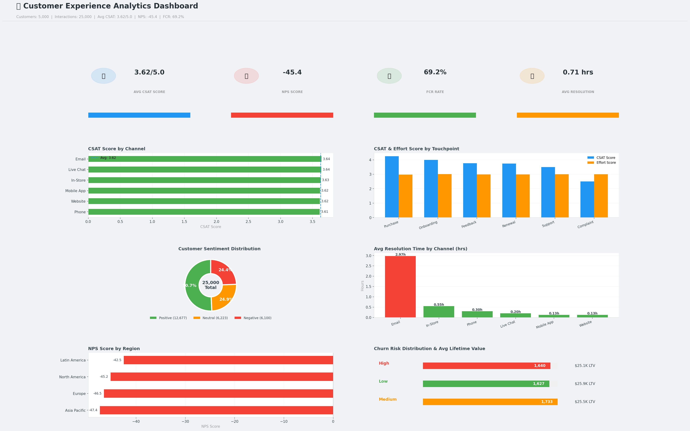

# Customer Experience Analytics Dashboard

An end-to-end customer experience analytics project analyzing CSAT scores,
NPS, sentiment, resolution times, and churn risk across 5,000 customers
and 25,000 interactions.

## CX Summary
- **Total Customers:** 5,000
- **Total Interactions:** 25,000
- **Avg CSAT Score:** 3.62/5.0
- **NPS Score:** -45.4
- **FCR Rate:** 69.2%
- **Avg Resolution Time:** 0.71 hrs
- **Avg Effort Score:** 2.99/5.0

## Dashboard Visualizations

## Dashboard Sections
1. **KPI Cards** — CSAT, NPS, FCR Rate, Avg Resolution Time
2. **CSAT Score by Channel** — Website, Mobile App, Phone, Email, Live Chat, In-Store
3. **CSAT & Effort Score by Touchpoint** — Onboarding, Purchase, Support, Renewal, Complaint, Feedback
4. **Customer Sentiment Distribution** — Positive, Neutral, Negative donut chart
5. **Avg Resolution Time by Channel** — Bar chart with color coding
6. **NPS Score by Region** — North America, Europe, Asia Pacific, Latin America
7. **Churn Risk Distribution** — Low, Medium, High with Avg Lifetime Value

## Key Insights
- FCR rate of 69.2% — 30.8% of issues require multiple contacts
- Email has the highest resolution time vs Live Chat being fastest
- Complaint touchpoint has the lowest CSAT score
- Purchase touchpoint has the highest CSAT score

## Dataset Features
- 5,000 customer profiles
- 25,000 interaction records
- 6 channels, 6 touchpoints
- NPS, CSAT, effort scores
- Churn risk and lifetime value

## Technologies
- Python, Pandas, NumPy
- Matplotlib, Seaborn
- Google Colab (T4 GPU)
